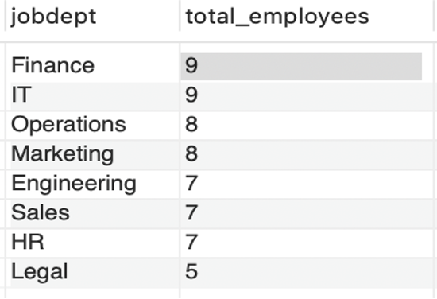
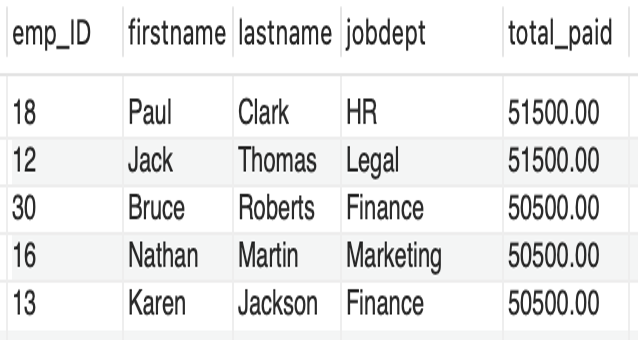
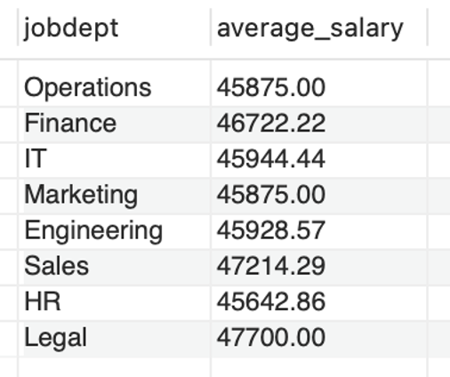
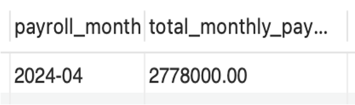
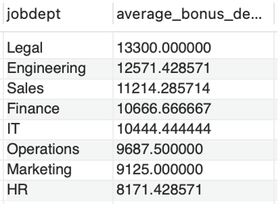
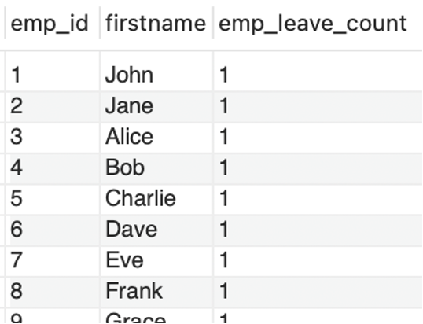

# Employee Management System (SQL Project)


## Project Overview
This project implements an Employee Management System (EMS) using SQL to efficiently manage and analyze employee data within an organization. The system stores employee information such as personal details, job roles, departmental assignments, payroll records, qualifications, and leave management.

The database is designed using relational schema principles with primary and foreign key relationships to ensure data integrity and consistency. SQL queries are used to analyze workforce distribution, payroll expenses, job role structures, and employee leave patterns to support HR decision-making.

## Description

A relational database project that manages employee details, job roles, departments, payroll, qualifications, and leave records. It uses SQL queries and a structured schema design to ensure data integrity and generate insights on workforce distribution, payroll costs, and HR operations.

## Problem Statement

The objective of this project is to design and implement an **Employee Management System** that efficiently stores and manages employee-related data within an organization. The system needs to track various aspects of employee information, including personal details, job roles, salary structures, qualifications, leave records, and payroll data. The system should ensure the integrity and consistency of data by using relational tables with appropriate foreign keys and cascading actions.
The system should allow for easy management and querying of employee data, providing insights such as payroll calculation, leave tracking, and department-specific job roles. The goal is to streamline HR operations, ensuring that all relevant employee data is accessible and accurately updated across different modules.


## Database Tables

The system consists of **six interconnected tables**:

* **Employee** – Stores employee personal and contact information
* **JobDepartment** – Contains department details and job roles
* **SalaryBonus** – Stores salary structures and bonus details
* **Qualification** – Tracks employee qualifications and skills
* **Leaves** – Maintains employee leave records
* **Payroll** – Records salary payments and payroll calculations

## Key Features

* Structured **relational database schema**
* Use of **Primary Keys and Foreign Keys**
* Data integrity through **cascading updates and deletes**
* SQL-based analysis for **HR insights and payroll reporting**

<h2>Entity Relationship Diagram</h2>

<p align="center">
  
</p>

<p align="center">
  The ER diagram illustrates the relationships between the six core tables used in the Employee Management System database.
</p>


## SQL Analysis

The project performs analysis to answer important HR-related questions such as:

* Employee distribution across departments
* Average salary by department
* Highest-paid employees
* Payroll expenditure analysis
* Leave patterns and employee absence trends
* Department-wise compensation insights

## Sample Analysis Results


<h3>Department-wise Employee Distribution</h3>
<p align="center">
  
</p>

<h3>Top 5 Highest Paid Employees</h3>
<p align="center">
  
</p>

<h3>Average Salary per Department</h3>
<p align="center">
  
</p>

<h3>Monthly Payroll Analysis</h3>
<p align="center">
  
</p>

<h3>Department Bonus Distribution</h3>
<p align="center">
  
</p>

<h3>Leave Analysis</h3>
<p align="center">
  
</p>

## Key Insights

• Finance and IT departments have the highest number of employees, indicating their importance in operational activities.

• Payroll analysis shows the organization spends approximately **2.7M per month**, highlighting payroll as a major operational cost.

• The **Finance Director role offers the highest salary**, reflecting leadership-level compensation structures.

• Leave patterns appear balanced across departments, suggesting consistent HR leave policies.

• Department bonus allocation indicates higher compensation concentration in strategic departments such as Finance.

---
## Project Structure

### Folder Description

- **Data/** → Raw datasets used in the project  
- **SQL_Files/** → SQL scripts for schema creation, data import, and analysis queries  
- **Files/** → ER diagram and project documentation  
- **README.md** → Project overview and instructions

---

## Technologies Used

- **SQL** – Data querying and analysis  
- **MySQL** – Relational database management system  
- **MySQL Workbench** – Database design and query execution  
- **CSV Datasets** – Structured employee and HR data  
- **GitHub** – Project version control and documentation

## Project Goal

The goal of this project is to demonstrate how a well-designed relational database and SQL analysis can help **streamline HR operations, manage employee data efficiently, and support data-driven decision-making**.

## Conclusion

This project demonstrates the design and implementation of an Employee Management System using SQL.  
The system efficiently organizes employee information, job roles, payroll records, qualifications, and leave management using relational database principles.

Through SQL analysis, the project provides insights into workforce distribution, salary allocation, payroll expenditure, and leave patterns, helping organizations make better HR decisions.  
The structured schema and analytical queries highlight the importance of data-driven approaches in managing employee information and improving operational efficiency.

---

## How to Run the Project

Follow these steps to recreate and run this project on your local machine.

### 1. Clone the Repository
```bash
git clone https://github.com/chityala-bhavani-chary/SQL_Employee_Management_System.git
```
### 2. Open MySQL Workbench
Create a new connection to your MySQL server.

### 3. Create the Database
Run the SQL script located in the `sql` folder.

```sql
CREATE DATABASE Employee_Management_System_project;
USE Employee_Management_System_project;
```
### 4. Create Tables
Run the table creation script:

```
sql/table_creation.sql
```

### 5. Import Dataset
Import the CSV files from the `data` folder into the respective tables.

### 6. Run Analysis Queries
Execute the SQL queries located in:

```
sql/analysis_queries.sql
```

These queries generate insights on employee distribution, salary allocation, payroll analysis, and leave patterns.
